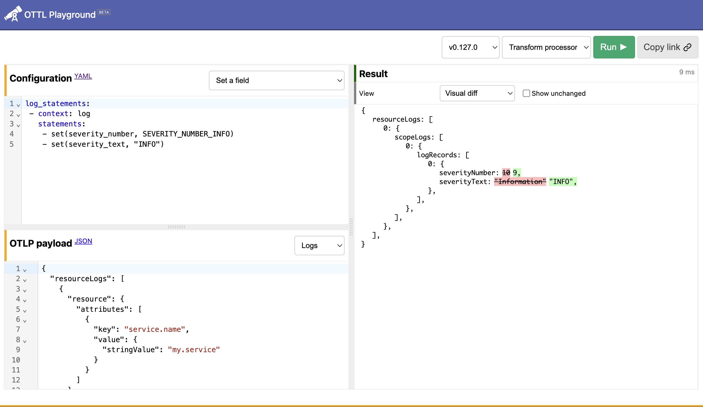

# OTTL (OpenTelemetry Transformation Language) Workshop

## Overview
This workshop lets student test how to apply various transformation statements learn how to use OTTL for various use cases

## How to use

1. Open your browser and visit <a href="https://ottl.run" target="_blank">https://ottl.run</a> which is the OTTL playground web page
2. Copy the json payload (*.json files)
3. Copy the matching YAML configuration that matches the payload (*.yaml files)
4. Press `run` button to see the results

## Use Cases

The following use cases are available:

|OTLP Payload|Configuration|link|Description|
|---|---|---|---|
|[1-log.json](1-log.json)|[1-log.yaml](1-log.yaml)|[link](https://ottl.run/#eyJ2ZXJzaW9uIjoidjAuMTI4LjAiLCJldmFsdWF0b3IiOiJ0cmFuc2Zvcm1fcHJvY2Vzc29yIiwicGF5bG9hZCI6IntcInJlc291cmNlTG9nc1wiOlt7XCJyZXNvdXJjZVwiOntcImF0dHJpYnV0ZXNcIjpbe1wia2V5XCI6XCJzZXJ2aWNlLm5hbWVcIixcInZhbHVlXCI6e1wic3RyaW5nVmFsdWVcIjpcIm90ZWwtbzExeS13b3Jrc2hvcFwifX1dfSxcInNjb3BlTG9nc1wiOlt7XCJzY29wZVwiOntcIm5hbWVcIjpcIndvcmtzaG9wLmxpYnJhcnlcIixcInZlcnNpb25cIjpcIjEuMC4wXCIsXCJhdHRyaWJ1dGVzXCI6W3tcImtleVwiOlwibGlicmFyeS5kZXNjcmlwdGlvblwiLFwidmFsdWVcIjp7XCJzdHJpbmdWYWx1ZVwiOlwiVGhpcyBpcyBmb3IgdGVzdGluZyBwdXJwb3NlIG9ubHkuXCJ9fV19LFwibG9nUmVjb3Jkc1wiOlt7XCJ0aW1lVW5peE5hbm9cIjpcIjE1NDQ3MTI2NjAzMDAwMDAwMDBcIixcIm9ic2VydmVkVGltZVVuaXhOYW5vXCI6XCIxNTQ0NzEyNjYwMzAwMDAwMDAwXCIsXCJzZXZlcml0eU51bWJlclwiOjEwLFwidHJhY2VJZFwiOlwiNWI4ZWZmZjc5ODAzODEwM2QyNjliNjMzODEzZmM2MGNcIixcInNwYW5JZFwiOlwiZWVlMTliN2VjM2MxYjE3NFwiLFwiYm9keVwiOntcInN0cmluZ1ZhbHVlXCI6XCJ7XFxcInRpbWVzdGFtcFxcXCI6IFxcXCIyMDI1LTAzLTAxVDEyOjEyOjE0WlxcXCIsIFxcXCJsZXZlbFxcXCI6XFxcIklORk9cXFwiLFxcXCJtZXNzYWdlXFxcIjpcXFwiRWxhcHNlZCB0aW1lOiAxMG1zXFxcIn1cIn19XX1dfV19IiwiY29uZmlnIjoibG9nX3N0YXRlbWVudHM6XG4gLSBjb250ZXh0OiBsb2dcbiAgIHN0YXRlbWVudHM6XG4gICAgLSBtZXJnZV9tYXBzKGNhY2hlLCBQYXJzZUpTT04oYm9keSksIFwidXBzZXJ0XCIpIHdoZXJlIElzTWF0Y2goYm9keSwgXCJeXFxcXHtcIilcbiAgICAtIHNldCh0aW1lLCBUaW1lKGNhY2hlW1widGltZXN0YW1wXCJdLCBcIiVZLSVtLSVkVCVIOiVNOiVTWlwiKSlcbiAgICAtIHNldChzZXZlcml0eV90ZXh0LCBjYWNoZVtcImxldmVsXCJdKVxuICAgIC0gc2V0KGJvZHksIGNhY2hlW1wibWVzc2FnZVwiXSlcbiAgICAtICdtZXJnZV9tYXBzKGF0dHJpYnV0ZXMsIEV4dHJhY3RQYXR0ZXJucyhjYWNoZVtcIm1lc3NhZ2VcIl0sIFwiRWxhcHNlZCB0aW1lOiAoP1A8ZHVyYXRpb25fbXM+WzAtOV0rKW1zXCIpLCBcInVwc2VydFwiKScifQ==)|Parse the incoming log body which is in JSON format, and generate attributes. The incoming log body is formatted in JSON, and we want to expose those as attributes of the log record.|
|[1-trace.json](1-log.json)|[2-trace.yaml](2-trace.yaml)|[link](https://ottl.run/#eyJ2ZXJzaW9uIjoidjAuMTI4LjAiLCJldmFsdWF0b3IiOiJ0cmFuc2Zvcm1fcHJvY2Vzc29yIiwicGF5bG9hZCI6IntcInJlc291cmNlU3BhbnNcIjpbe1wicmVzb3VyY2VcIjp7XCJhdHRyaWJ1dGVzXCI6W3tcImtleVwiOlwic2VydmljZS5uYW1lXCIsXCJ2YWx1ZVwiOntcInN0cmluZ1ZhbHVlXCI6XCJoZm9cIn19LHtcImtleVwiOlwidGVsZW1ldHJ5LnNkay5sYW5ndWFnZVwiLFwidmFsdWVcIjp7XCJzdHJpbmdWYWx1ZVwiOlwid2VianNcIn19LHtcImtleVwiOlwidGVsZW1ldHJ5LnNkay5uYW1lXCIsXCJ2YWx1ZVwiOntcInN0cmluZ1ZhbHVlXCI6XCJvcGVudGVsZW1ldHJ5XCJ9fSx7XCJrZXlcIjpcInRlbGVtZXRyeS5zZGsudmVyc2lvblwiLFwidmFsdWVcIjp7XCJzdHJpbmdWYWx1ZVwiOlwiMS4yNi4wXCJ9fSx7XCJrZXlcIjpcInVzZXJfYWdlbnQub3JpZ2luYWxcIixcInZhbHVlXCI6e1wic3RyaW5nVmFsdWVcIjpcIk1vemlsbGEvNS4wIChNYWNpbnRvc2g7IEludGVsIE1hYyBPUyBYIDEwXzE1XzcpIEFwcGxlV2ViS2l0LzUzNy4zNiAoS0hUTUwsIGxpa2UgR2Vja28pIENocm9tZS8xMzcuMC4wLjAgU2FmYXJpLzUzNy4zNlwifX0se1wia2V5XCI6XCJicm93c2VyLm1vYmlsZVwiLFwidmFsdWVcIjp7XCJib29sVmFsdWVcIjpmYWxzZX19LHtcImtleVwiOlwiYnJvd3Nlci50b3VjaF9zY3JlZW5fZW5hYmxlZFwiLFwidmFsdWVcIjp7XCJib29sVmFsdWVcIjpmYWxzZX19LHtcImtleVwiOlwiYnJvd3Nlci5sYW5ndWFnZVwiLFwidmFsdWVcIjp7XCJzdHJpbmdWYWx1ZVwiOlwiZW4tVVNcIn19LHtcImtleVwiOlwiYnJvd3Nlci5uYW1lXCIsXCJ2YWx1ZVwiOntcInN0cmluZ1ZhbHVlXCI6XCJDaHJvbWVcIn19LHtcImtleVwiOlwiYnJvd3Nlci52ZXJzaW9uXCIsXCJ2YWx1ZVwiOntcInN0cmluZ1ZhbHVlXCI6XCIxMzcuMC4wLjBcIn19LHtcImtleVwiOlwiZGV2aWNlLnR5cGVcIixcInZhbHVlXCI6e1wic3RyaW5nVmFsdWVcIjpcImRlc2t0b3BcIn19LHtcImtleVwiOlwibmV0d29yay5lZmZlY3RpdmVUeXBlXCIsXCJ2YWx1ZVwiOntcInN0cmluZ1ZhbHVlXCI6XCI0Z1wifX0se1wia2V5XCI6XCJzY3JlZW4ud2lkdGhcIixcInZhbHVlXCI6e1wiaW50VmFsdWVcIjpcIjM4NDBcIn19LHtcImtleVwiOlwic2NyZWVuLmhlaWdodFwiLFwidmFsdWVcIjp7XCJpbnRWYWx1ZVwiOlwiMTA4MFwifX0se1wia2V5XCI6XCJzY3JlZW4uc2l6ZVwiLFwidmFsdWVcIjp7XCJzdHJpbmdWYWx1ZVwiOlwibGFyZ2VcIn19LHtcImtleVwiOlwiZW50cnlfcGFnZS51cmxcIixcInZhbHVlXCI6e319LHtcImtleVwiOlwiZW50cnlfcGFnZS5wYXRoXCIsXCJ2YWx1ZVwiOntcInN0cmluZ1ZhbHVlXCI6XCIvXCJ9fSx7XCJrZXlcIjpcImVudHJ5X3BhZ2Uuc2VhcmNoXCIsXCJ2YWx1ZVwiOnt9fSx7XCJrZXlcIjpcImVudHJ5X3BhZ2UuaGFzaFwiLFwidmFsdWVcIjp7XCJzdHJpbmdWYWx1ZVwiOlwiXCJ9fSx7XCJrZXlcIjpcImVudHJ5X3BhZ2UuaG9zdG5hbWVcIixcInZhbHVlXCI6e1wic3RyaW5nVmFsdWVcIjpcImxvY2FsaG9zdFwifX0se1wia2V5XCI6XCJlbnRyeV9wYWdlLnJlZmVycmVyXCIsXCJ2YWx1ZVwiOntcInN0cmluZ1ZhbHVlXCI6XCJcIn19LHtcImtleVwiOlwiaG9uZXljb21iLmRpc3Ryby52ZXJzaW9uXCIsXCJ2YWx1ZVwiOntcInN0cmluZ1ZhbHVlXCI6XCIwLjguMVwifX0se1wia2V5XCI6XCJob25leWNvbWIuZGlzdHJvLnJ1bnRpbWVfdmVyc2lvblwiLFwidmFsdWVcIjp7XCJzdHJpbmdWYWx1ZVwiOlwiYnJvd3NlclwifX0se1wia2V5XCI6XCJicm93c2VyLnBsYXRmb3JtXCIsXCJ2YWx1ZVwiOntcInN0cmluZ1ZhbHVlXCI6XCJtYWNPU1wifX0se1wia2V5XCI6XCJicm93c2VyLmJyYW5kc1wiLFwidmFsdWVcIjp7XCJhcnJheVZhbHVlXCI6e1widmFsdWVzXCI6W3tcInN0cmluZ1ZhbHVlXCI6XCJHb29nbGUgQ2hyb21lIDEzN1wifSx7XCJzdHJpbmdWYWx1ZVwiOlwiQ2hyb21pdW0gMTM3XCJ9LHtcInN0cmluZ1ZhbHVlXCI6XCJOb3QvQSlCcmFuZCAyNFwifV19fX1dfSxcInNjb3BlU3BhbnNcIjpbe1wic2NvcGVcIjp7XCJuYW1lXCI6XCJAb3BlbnRlbGVtZXRyeS9pbnN0cnVtZW50YXRpb24tZG9jdW1lbnQtbG9hZFwiLFwidmVyc2lvblwiOlwiMC40MS4wXCJ9LFwic3BhbnNcIjpbe1widHJhY2VJZFwiOlwiMGY3MWI5NTE4YTQxNDY3YWIzYzk4M2E1OTRlNzUzZDZcIixcInNwYW5JZFwiOlwiMWIxZTk1NDJkNGQ1NWI0MFwiLFwicGFyZW50U3BhbklkXCI6XCI5OTkxYmVkMDg4YjBhMzgyXCIsXCJuYW1lXCI6XCJkb2N1bWVudEZldGNoXCIsXCJraW5kXCI6MSxcInN0YXJ0VGltZVVuaXhOYW5vXCI6XCIxNzQ4OTE4NzI1MTc1MzAwMDAwXCIsXCJlbmRUaW1lVW5peE5hbm9cIjpcIjE3NDg5MTg3MjUxODEyMDAwMDBcIixcImF0dHJpYnV0ZXNcIjpbe1wia2V5XCI6XCJTYW1wbGVSYXRlXCIsXCJ2YWx1ZVwiOntcImludFZhbHVlXCI6XCIxXCJ9fSx7XCJrZXlcIjpcImJyb3dzZXIud2lkdGhcIixcInZhbHVlXCI6e1wiaW50VmFsdWVcIjpcIjExODNcIn19LHtcImtleVwiOlwiYnJvd3Nlci5oZWlnaHRcIixcInZhbHVlXCI6e1wiaW50VmFsdWVcIjpcIjkwMFwifX0se1wia2V5XCI6XCJwYWdlLmhhc2hcIixcInZhbHVlXCI6e1wic3RyaW5nVmFsdWVcIjpcIlwifX0se1wia2V5XCI6XCJwYWdlLnVybFwiLFwidmFsdWVcIjp7XCJzdHJpbmdWYWx1ZVwiOlwiaHR0cDovL2xvY2FsaG9zdDoyMjAyMi9cIn19LHtcImtleVwiOlwicGFnZS5yb3V0ZVwiLFwidmFsdWVcIjp7XCJzdHJpbmdWYWx1ZVwiOlwiL1wifX0se1wia2V5XCI6XCJwYWdlLmhvc3RuYW1lXCIsXCJ2YWx1ZVwiOntcInN0cmluZ1ZhbHVlXCI6XCJsb2NhbGhvc3RcIn19LHtcImtleVwiOlwicGFnZS5zZWFyY2hcIixcInZhbHVlXCI6e1wic3RyaW5nVmFsdWVcIjpcIlwifX0se1wia2V5XCI6XCJ1cmwucGF0aFwiLFwidmFsdWVcIjp7XCJzdHJpbmdWYWx1ZVwiOlwiL1wifX0se1wia2V5XCI6XCJzZXNzaW9uLmlkXCIsXCJ2YWx1ZVwiOntcInN0cmluZ1ZhbHVlXCI6XCJjMTgyYWRmMmIyMmJjMGY0YzU4MGZjMDUzOTFlZWY4ZVwifX0se1wia2V5XCI6XCJodHRwLnVybFwiLFwidmFsdWVcIjp7XCJzdHJpbmdWYWx1ZVwiOlwiaHR0cDovL2xvY2FsaG9zdDoyMjAyMi9cIn19LHtcImtleVwiOlwiaHR0cC5yZXNwb25zZV9jb250ZW50X2xlbmd0aFwiLFwidmFsdWVcIjp7XCJpbnRWYWx1ZVwiOlwiMzc1MVwifX1dLFwiZXZlbnRzXCI6W3tcInRpbWVVbml4TmFub1wiOlwiMTc0ODkxODcyNTE3NTMwMDAwMFwiLFwibmFtZVwiOlwiZmV0Y2hTdGFydFwifSx7XCJ0aW1lVW5peE5hbm9cIjpcIjE3NDg5MTg3MjUxNzcxMDAwMDBcIixcIm5hbWVcIjpcImRvbWFpbkxvb2t1cFN0YXJ0XCJ9LHtcInRpbWVVbml4TmFub1wiOlwiMTc0ODkxODcyNTE3NzEwMDAwMFwiLFwibmFtZVwiOlwiZG9tYWluTG9va3VwRW5kXCJ9LHtcInRpbWVVbml4TmFub1wiOlwiMTc0ODkxODcyNTE3NzEwMDAwMFwiLFwibmFtZVwiOlwiY29ubmVjdFN0YXJ0XCJ9LHtcInRpbWVVbml4TmFub1wiOlwiMTc0ODkxODcyNTE3NzUwMDAwMFwiLFwibmFtZVwiOlwiY29ubmVjdEVuZFwifSx7XCJ0aW1lVW5peE5hbm9cIjpcIjE3NDg5MTg3MjUxNzc1MDAwMDBcIixcIm5hbWVcIjpcInJlcXVlc3RTdGFydFwifSx7XCJ0aW1lVW5peE5hbm9cIjpcIjE3NDg5MTg3MjUxODA5MDAwMDBcIixcIm5hbWVcIjpcInJlc3BvbnNlU3RhcnRcIn0se1widGltZVVuaXhOYW5vXCI6XCIxNzQ4OTE4NzI1MTgxMjAwMDAwXCIsXCJuYW1lXCI6XCJyZXNwb25zZUVuZFwifV0sXCJzdGF0dXNcIjp7fX0se1widHJhY2VJZFwiOlwiMGY3MWI5NTE4YTQxNDY3YWIzYzk4M2E1OTRlNzUzZDZcIixcInNwYW5JZFwiOlwiYThhZWU0YzNjMWJkNzg2OFwiLFwicGFyZW50U3BhbklkXCI6XCI5OTkxYmVkMDg4YjBhMzgyXCIsXCJuYW1lXCI6XCJyZXNvdXJjZUZldGNoXCIsXCJraW5kXCI6MSxcInN0YXJ0VGltZVVuaXhOYW5vXCI6XCIxNzQ4OTE4NzI1MTg2NjAwMDAwXCIsXCJlbmRUaW1lVW5peE5hbm9cIjpcIjE3NDg5MTg3MjUyMDA2MDAwMDBcIixcImF0dHJpYnV0ZXNcIjpbe1wia2V5XCI6XCJTYW1wbGVSYXRlXCIsXCJ2YWx1ZVwiOntcImludFZhbHVlXCI6XCIxXCJ9fSx7XCJrZXlcIjpcImJyb3dzZXIud2lkdGhcIixcInZhbHVlXCI6e1wiaW50VmFsdWVcIjpcIjExODNcIn19LHtcImtleVwiOlwiYnJvd3Nlci5oZWlnaHRcIixcInZhbHVlXCI6e1wiaW50VmFsdWVcIjpcIjkwMFwifX0se1wia2V5XCI6XCJwYWdlLmhhc2hcIixcInZhbHVlXCI6e1wic3RyaW5nVmFsdWVcIjpcIlwifX0se1wia2V5XCI6XCJwYWdlLnVybFwiLFwidmFsdWVcIjp7XCJzdHJpbmdWYWx1ZVwiOlwiaHR0cDovL2xvY2FsaG9zdDoyMjAyMi9cIn19LHtcImtleVwiOlwicGFnZS5yb3V0ZVwiLFwidmFsdWVcIjp7XCJzdHJpbmdWYWx1ZVwiOlwiL1wifX0se1wia2V5XCI6XCJwYWdlLmhvc3RuYW1lXCIsXCJ2YWx1ZVwiOntcInN0cmluZ1ZhbHVlXCI6XCJsb2NhbGhvc3RcIn19LHtcImtleVwiOlwicGFnZS5zZWFyY2hcIixcInZhbHVlXCI6e1wic3RyaW5nVmFsdWVcIjpcIlwifX0se1wia2V5XCI6XCJ1cmwucGF0aFwiLFwidmFsdWVcIjp7XCJzdHJpbmdWYWx1ZVwiOlwiL1wifX0se1wia2V5XCI6XCJzZXNzaW9uLmlkXCIsXCJ2YWx1ZVwiOntcInN0cmluZ1ZhbHVlXCI6XCJjMTgyYWRmMmIyMmJjMGY0YzU4MGZjMDUzOTFlZWY4ZVwifX0se1wia2V5XCI6XCJodHRwLnVybFwiLFwidmFsdWVcIjp7XCJzdHJpbmdWYWx1ZVwiOlwiaHR0cDovL2xvY2FsaG9zdDoyMjAyMi9vdGVsd2ViLmpzXCJ9fSx7XCJrZXlcIjpcImh0dHAucmVzcG9uc2VfY29udGVudF9sZW5ndGhcIixcInZhbHVlXCI6e1wiaW50VmFsdWVcIjpcIjMwMjk1MlwifX1dLFwiZXZlbnRzXCI6W3tcInRpbWVVbml4TmFub1wiOlwiMTc0ODkxODcyNTE4NjYwMDAwMFwiLFwibmFtZVwiOlwiZmV0Y2hTdGFydFwifSx7XCJ0aW1lVW5peE5hbm9cIjpcIjE3NDg5MTg3MjUxODY2MDAwMDBcIixcIm5hbWVcIjpcImRvbWFpbkxvb2t1cFN0YXJ0XCJ9LHtcInRpbWVVbml4TmFub1wiOlwiMTc0ODkxODcyNTE4NjYwMDAwMFwiLFwibmFtZVwiOlwiZG9tYWluTG9va3VwRW5kXCJ9LHtcInRpbWVVbml4TmFub1wiOlwiMTc0ODkxODcyNTE4NjYwMDAwMFwiLFwibmFtZVwiOlwiY29ubmVjdFN0YXJ0XCJ9LHtcInRpbWVVbml4TmFub1wiOlwiMTc0ODkxODcyNTE4NjYwMDAwMFwiLFwibmFtZVwiOlwiY29ubmVjdEVuZFwifSx7XCJ0aW1lVW5peE5hbm9cIjpcIjE3NDg5MTg3MjUxOTQ2MDAwMDBcIixcIm5hbWVcIjpcInJlcXVlc3RTdGFydFwifSx7XCJ0aW1lVW5peE5hbm9cIjpcIjE3NDg5MTg3MjUxOTYzMDAwMDBcIixcIm5hbWVcIjpcInJlc3BvbnNlU3RhcnRcIn0se1widGltZVVuaXhOYW5vXCI6XCIxNzQ4OTE4NzI1MjAwNjAwMDAwXCIsXCJuYW1lXCI6XCJyZXNwb25zZUVuZFwifV0sXCJzdGF0dXNcIjp7fX0se1widHJhY2VJZFwiOlwiMGY3MWI5NTE4YTQxNDY3YWIzYzk4M2E1OTRlNzUzZDZcIixcInNwYW5JZFwiOlwiN2U2Y2M1ODhiNGM5YTJiMVwiLFwicGFyZW50U3BhbklkXCI6XCI5OTkxYmVkMDg4YjBhMzgyXCIsXCJuYW1lXCI6XCJyZXNvdXJjZUZldGNoXCIsXCJraW5kXCI6MSxcInN0YXJ0VGltZVVuaXhOYW5vXCI6XCIxNzQ4OTE4NzI1MTg2Njk5OTAyXCIsXCJlbmRUaW1lVW5peE5hbm9cIjpcIjE3NDg5MTg3MjUyMDQzOTk5MDJcIixcImF0dHJpYnV0ZXNcIjpbe1wia2V5XCI6XCJTYW1wbGVSYXRlXCIsXCJ2YWx1ZVwiOntcImludFZhbHVlXCI6XCIxXCJ9fSx7XCJrZXlcIjpcImJyb3dzZXIud2lkdGhcIixcInZhbHVlXCI6e1wiaW50VmFsdWVcIjpcIjExODNcIn19LHtcImtleVwiOlwiYnJvd3Nlci5oZWlnaHRcIixcInZhbHVlXCI6e1wiaW50VmFsdWVcIjpcIjkwMFwifX0se1wia2V5XCI6XCJwYWdlLmhhc2hcIixcInZhbHVlXCI6e1wic3RyaW5nVmFsdWVcIjpcIlwifX0se1wia2V5XCI6XCJwYWdlLnVybFwiLFwidmFsdWVcIjp7XCJzdHJpbmdWYWx1ZVwiOlwiaHR0cDovL2xvY2FsaG9zdDoyMjAyMi9cIn19LHtcImtleVwiOlwicGFnZS5yb3V0ZVwiLFwidmFsdWVcIjp7XCJzdHJpbmdWYWx1ZVwiOlwiL1wifX0se1wia2V5XCI6XCJwYWdlLmhvc3RuYW1lXCIsXCJ2YWx1ZVwiOntcInN0cmluZ1ZhbHVlXCI6XCJsb2NhbGhvc3RcIn19LHtcImtleVwiOlwicGFnZS5zZWFyY2hcIixcInZhbHVlXCI6e1wic3RyaW5nVmFsdWVcIjpcIlwifX0se1wia2V5XCI6XCJ1cmwucGF0aFwiLFwidmFsdWVcIjp7XCJzdHJpbmdWYWx1ZVwiOlwiL1wifX0se1wia2V5XCI6XCJzZXNzaW9uLmlkXCIsXCJ2YWx1ZVwiOntcInN0cmluZ1ZhbHVlXCI6XCJjMTgyYWRmMmIyMmJjMGY0YzU4MGZjMDUzOTFlZWY4ZVwifX0se1wia2V5XCI6XCJodHRwLnVybFwiLFwidmFsdWVcIjp7XCJzdHJpbmdWYWx1ZVwiOlwiaHR0cDovL2xvY2FsaG9zdDoyMjAyMi9sb2FkaW5nLW1lbWUuZ2lmXCJ9fSx7XCJrZXlcIjpcImh0dHAucmVzcG9uc2VfY29udGVudF9sZW5ndGhcIixcInZhbHVlXCI6e1wiaW50VmFsdWVcIjpcIjQ5MDcyN1wifX1dLFwiZXZlbnRzXCI6W3tcInRpbWVVbml4TmFub1wiOlwiMTc0ODkxODcyNTE4NjY5OTkwMlwiLFwibmFtZVwiOlwiZmV0Y2hTdGFydFwifSx7XCJ0aW1lVW5peE5hbm9cIjpcIjE3NDg5MTg3MjUxODY2OTk5MDJcIixcIm5hbWVcIjpcImRvbWFpbkxvb2t1cFN0YXJ0XCJ9LHtcInRpbWVVbml4TmFub1wiOlwiMTc0ODkxODcyNTE4NjY5OTkwMlwiLFwibmFtZVwiOlwiZG9tYWluTG9va3VwRW5kXCJ9LHtcInRpbWVVbml4TmFub1wiOlwiMTc0ODkxODcyNTE4NjY5OTkwMlwiLFwibmFtZVwiOlwiY29ubmVjdFN0YXJ0XCJ9LHtcInRpbWVVbml4TmFub1wiOlwiMTc0ODkxODcyNTE4NjY5OTkwMlwiLFwibmFtZVwiOlwiY29ubmVjdEVuZFwifSx7XCJ0aW1lVW5peE5hbm9cIjpcIjE3NDg5MTg3MjUyMDA4OTk5MDJcIixcIm5hbWVcIjpcInJlcXVlc3RTdGFydFwifSx7XCJ0aW1lVW5peE5hbm9cIjpcIjE3NDg5MTg3MjUyMDE5OTk5MDJcIixcIm5hbWVcIjpcInJlc3BvbnNlU3RhcnRcIn0se1widGltZVVuaXhOYW5vXCI6XCIxNzQ4OTE4NzI1MjA0Mzk5OTAyXCIsXCJuYW1lXCI6XCJyZXNwb25zZUVuZFwifV0sXCJzdGF0dXNcIjp7fX1dfV19XX0iLCJjb25maWciOiJ0cmFjZV9zdGF0ZW1lbnRzOlxuICAtIGNvbnRleHQ6IHNwYW5ldmVudFxuICAgIHN0YXRlbWVudHM6XG4gICAgICAjIGpzLWJyb3dzZXIgZG9jdW1lbnQtbG9hZFxuICAgICAgLSBzZXQoc3Bhbi5hdHRyaWJ1dGVzW1wid2VianMuY29ubmVjdEVuZF9tc1wiXSwgKHRpbWVfdW5peF9uYW5vIC0gc3Bhbi5zdGFydF90aW1lX3VuaXhfbmFubykgLyAxMDAwMDAwKSB3aGVyZSBuYW1lID09IFwiY29ubmVjdEVuZFwiIGFuZCBpbnN0cnVtZW50YXRpb25fc2NvcGUubmFtZSA9PSBcIkBvcGVudGVsZW1ldHJ5L2luc3RydW1lbnRhdGlvbi1kb2N1bWVudC1sb2FkXCJcbiAgICAgIC0gc2V0KHNwYW4uYXR0cmlidXRlc1tcIndlYmpzLmNvbm5lY3RTdGFydF9tc1wiXSwgKHRpbWVfdW5peF9uYW5vIC0gc3Bhbi5zdGFydF90aW1lX3VuaXhfbmFubykgLyAxMDAwMDAwKSB3aGVyZSBuYW1lID09IFwiY29ubmVjdFN0YXJ0XCIgYW5kIGluc3RydW1lbnRhdGlvbl9zY29wZS5uYW1lID09IFwiQG9wZW50ZWxlbWV0cnkvaW5zdHJ1bWVudGF0aW9uLWRvY3VtZW50LWxvYWRcIlxuICAgICAgLSBzZXQoc3Bhbi5hdHRyaWJ1dGVzW1wid2VianMuZG9tYWluTG9va3VwRW5kX21zXCJdLCAodGltZV91bml4X25hbm8gLSBzcGFuLnN0YXJ0X3RpbWVfdW5peF9uYW5vKSAvIDEwMDAwMDApIHdoZXJlIG5hbWUgPT0gXCJkb21haW5Mb29rdXBFbmRcIiBhbmQgaW5zdHJ1bWVudGF0aW9uX3Njb3BlLm5hbWUgPT0gXCJAb3BlbnRlbGVtZXRyeS9pbnN0cnVtZW50YXRpb24tZG9jdW1lbnQtbG9hZFwiXG4gICAgICAtIHNldChzcGFuLmF0dHJpYnV0ZXNbXCJ3ZWJqcy5kb21haW5Mb29rdXBTdGFydF9tc1wiXSwgKHRpbWVfdW5peF9uYW5vIC0gc3Bhbi5zdGFydF90aW1lX3VuaXhfbmFubykgLyAxMDAwMDAwKSB3aGVyZSBuYW1lID09IFwiZG9tYWluTG9va3VwU3RhcnRcIiBhbmQgaW5zdHJ1bWVudGF0aW9uX3Njb3BlLm5hbWUgPT0gXCJAb3BlbnRlbGVtZXRyeS9pbnN0cnVtZW50YXRpb24tZG9jdW1lbnQtbG9hZFwiXG4gICAgICAtIHNldChzcGFuLmF0dHJpYnV0ZXNbXCJ3ZWJqcy5kb21Db21wbGV0ZV9tc1wiXSwgKHRpbWVfdW5peF9uYW5vIC0gc3Bhbi5zdGFydF90aW1lX3VuaXhfbmFubykgLyAxMDAwMDAwKSB3aGVyZSBuYW1lID09IFwiZG9tQ29tcGxldGVcIiBhbmQgaW5zdHJ1bWVudGF0aW9uX3Njb3BlLm5hbWUgPT0gXCJAb3BlbnRlbGVtZXRyeS9pbnN0cnVtZW50YXRpb24tZG9jdW1lbnQtbG9hZFwiXG4gICAgICAtIHNldChzcGFuLmF0dHJpYnV0ZXNbXCJ3ZWJqcy5kb21Db250ZW50TG9hZGVkRXZlbnRFbmRfbXNcIl0sICh0aW1lX3VuaXhfbmFubyAtIHNwYW4uc3RhcnRfdGltZV91bml4X25hbm8pIC8gMTAwMDAwMCkgd2hlcmUgbmFtZSA9PSBcImRvbUNvbnRlbnRMb2FkZWRFdmVudEVuZFwiIGFuZCBpbnN0cnVtZW50YXRpb25fc2NvcGUubmFtZSA9PSBcIkBvcGVudGVsZW1ldHJ5L2luc3RydW1lbnRhdGlvbi1kb2N1bWVudC1sb2FkXCJcbiAgICAgIC0gc2V0KHNwYW4uYXR0cmlidXRlc1tcIndlYmpzLmRvbUNvbnRlbnRMb2FkZWRFdmVudFN0YXJ0X21zXCJdLCAodGltZV91bml4X25hbm8gLSBzcGFuLnN0YXJ0X3RpbWVfdW5peF9uYW5vKSAvIDEwMDAwMDApIHdoZXJlIG5hbWUgPT0gXCJkb21Db250ZW50TG9hZGVkRXZlbnRTdGFydFwiIGFuZCBpbnN0cnVtZW50YXRpb25fc2NvcGUubmFtZSA9PSBcIkBvcGVudGVsZW1ldHJ5L2luc3RydW1lbnRhdGlvbi1kb2N1bWVudC1sb2FkXCJcbiAgICAgIC0gc2V0KHNwYW4uYXR0cmlidXRlc1tcIndlYmpzLmRvbUludGVyYWN0aXZlX21zXCJdLCAodGltZV91bml4X25hbm8gLSBzcGFuLnN0YXJ0X3RpbWVfdW5peF9uYW5vKSAvIDEwMDAwMDApIHdoZXJlIG5hbWUgPT0gXCJkb21JbnRlcmFjdGl2ZVwiIGFuZCBpbnN0cnVtZW50YXRpb25fc2NvcGUubmFtZSA9PSBcIkBvcGVudGVsZW1ldHJ5L2luc3RydW1lbnRhdGlvbi1kb2N1bWVudC1sb2FkXCJcbiAgICAgIC0gc2V0KHNwYW4uYXR0cmlidXRlc1tcIndlYmpzLmZldGNoU3RhcnRfbXNcIl0sICh0aW1lX3VuaXhfbmFubyAtIHNwYW4uc3RhcnRfdGltZV91bml4X25hbm8pIC8gMTAwMDAwMCkgd2hlcmUgbmFtZSA9PSBcImZldGNoU3RhcnRcIiBhbmQgaW5zdHJ1bWVudGF0aW9uX3Njb3BlLm5hbWUgPT0gXCJAb3BlbnRlbGVtZXRyeS9pbnN0cnVtZW50YXRpb24tZG9jdW1lbnQtbG9hZFwiXG4gICAgICAtIHNldChzcGFuLmF0dHJpYnV0ZXNbXCJ3ZWJqcy5maXJzdENvbnRlbnRmdWxQYWludF9tc1wiXSwgKHRpbWVfdW5peF9uYW5vIC0gc3Bhbi5zdGFydF90aW1lX3VuaXhfbmFubykgLyAxMDAwMDAwKSB3aGVyZSBuYW1lID09IFwiZmlyc3RDb250ZW50ZnVsUGFpbnRcIiBhbmQgaW5zdHJ1bWVudGF0aW9uX3Njb3BlLm5hbWUgPT0gXCJAb3BlbnRlbGVtZXRyeS9pbnN0cnVtZW50YXRpb24tZG9jdW1lbnQtbG9hZFwiXG4gICAgICAtIHNldChzcGFuLmF0dHJpYnV0ZXNbXCJ3ZWJqcy5maXJzdFBhaW50X21zXCJdLCAodGltZV91bml4X25hbm8gLSBzcGFuLnN0YXJ0X3RpbWVfdW5peF9uYW5vKSAvIDEwMDAwMDApIHdoZXJlIG5hbWUgPT0gXCJmaXJzdFBhaW50XCIgYW5kIGluc3RydW1lbnRhdGlvbl9zY29wZS5uYW1lID09IFwiQG9wZW50ZWxlbWV0cnkvaW5zdHJ1bWVudGF0aW9uLWRvY3VtZW50LWxvYWRcIlxuICAgICAgLSBzZXQoc3Bhbi5hdHRyaWJ1dGVzW1wid2VianMubG9hZEV2ZW50RW5kX21zXCJdLCAodGltZV91bml4X25hbm8gLSBzcGFuLnN0YXJ0X3RpbWVfdW5peF9uYW5vKSAvIDEwMDAwMDApIHdoZXJlIG5hbWUgPT0gXCJsb2FkRXZlbnRFbmRcIiBhbmQgaW5zdHJ1bWVudGF0aW9uX3Njb3BlLm5hbWUgPT0gXCJAb3BlbnRlbGVtZXRyeS9pbnN0cnVtZW50YXRpb24tZG9jdW1lbnQtbG9hZFwiXG4gICAgICAtIHNldChzcGFuLmF0dHJpYnV0ZXNbXCJ3ZWJqcy5sb2FkRXZlbnRTdGFydF9tc1wiXSwgKHRpbWVfdW5peF9uYW5vIC0gc3Bhbi5zdGFydF90aW1lX3VuaXhfbmFubykgLyAxMDAwMDAwKSB3aGVyZSBuYW1lID09IFwibG9hZEV2ZW50U3RhcnRcIiBhbmQgaW5zdHJ1bWVudGF0aW9uX3Njb3BlLm5hbWUgPT0gXCJAb3BlbnRlbGVtZXRyeS9pbnN0cnVtZW50YXRpb24tZG9jdW1lbnQtbG9hZFwiXG4gICAgICAtIHNldChzcGFuLmF0dHJpYnV0ZXNbXCJ3ZWJqcy5yZXF1ZXN0U3RhcnRfbXNcIl0sICh0aW1lX3VuaXhfbmFubyAtIHNwYW4uc3RhcnRfdGltZV91bml4X25hbm8pIC8gMTAwMDAwMCkgd2hlcmUgbmFtZSA9PSBcInJlcXVlc3RTdGFydFwiIGFuZCBpbnN0cnVtZW50YXRpb25fc2NvcGUubmFtZSA9PSBcIkBvcGVudGVsZW1ldHJ5L2luc3RydW1lbnRhdGlvbi1kb2N1bWVudC1sb2FkXCJcbiAgICAgIC0gc2V0KHNwYW4uYXR0cmlidXRlc1tcIndlYmpzLnJlc3BvbnNlRW5kX21zXCJdLCAodGltZV91bml4X25hbm8gLSBzcGFuLnN0YXJ0X3RpbWVfdW5peF9uYW5vKSAvIDEwMDAwMDApIHdoZXJlIG5hbWUgPT0gXCJyZXNwb25zZUVuZFwiIGFuZCBpbnN0cnVtZW50YXRpb25fc2NvcGUubmFtZSA9PSBcIkBvcGVudGVsZW1ldHJ5L2luc3RydW1lbnRhdGlvbi1kb2N1bWVudC1sb2FkXCJcbiAgICAgIC0gc2V0KHNwYW4uYXR0cmlidXRlc1tcIndlYmpzLnJlc3BvbnNlU3RhcnRfbXNcIl0sICh0aW1lX3VuaXhfbmFubyAtIHNwYW4uc3RhcnRfdGltZV91bml4X25hbm8pIC8gMTAwMDAwMCkgd2hlcmUgbmFtZSA9PSBcInJlc3BvbnNlU3RhcnRcIiBhbmQgaW5zdHJ1bWVudGF0aW9uX3Njb3BlLm5hbWUgPT0gXCJAb3BlbnRlbGVtZXRyeS9pbnN0cnVtZW50YXRpb24tZG9jdW1lbnQtbG9hZFwiXG4gICAgICAtIHNldChzcGFuLmF0dHJpYnV0ZXNbXCJ3ZWJqcy5zZWN1cmVDb25uZWN0aW9uU3RhcnRfbXNcIl0sICh0aW1lX3VuaXhfbmFubyAtIHNwYW4uc3RhcnRfdGltZV91bml4X25hbm8pIC8gMTAwMDAwMCkgd2hlcmUgbmFtZSA9PSBcInNlY3VyZUNvbm5lY3Rpb25TdGFydFwiIGFuZCBpbnN0cnVtZW50YXRpb25fc2NvcGUubmFtZSA9PSBcIkBvcGVudGVsZW1ldHJ5L2luc3RydW1lbnRhdGlvbi1kb2N1bWVudC1sb2FkXCJcbiAgICAgIC0gc2V0KHNwYW4uYXR0cmlidXRlc1tcIndlYmpzLnVubG9hZEV2ZW50RW5kX21zXCJdLCAodGltZV91bml4X25hbm8gLSBzcGFuLnN0YXJ0X3RpbWVfdW5peF9uYW5vKSAvIDEwMDAwMDApIHdoZXJlIG5hbWUgPT0gXCJ1bmxvYWRFdmVudEVuZFwiIGFuZCBpbnN0cnVtZW50YXRpb25fc2NvcGUubmFtZSA9PSBcIkBvcGVudGVsZW1ldHJ5L2luc3RydW1lbnRhdGlvbi1kb2N1bWVudC1sb2FkXCJcbiAgICAgIC0gc2V0KHNwYW4uYXR0cmlidXRlc1tcIndlYmpzLnVubG9hZEV2ZW50U3RhcnRfbXNcIl0sICh0aW1lX3VuaXhfbmFubyAtIHNwYW4uc3RhcnRfdGltZV91bml4X25hbm8pIC8gMTAwMDAwMCkgd2hlcmUgbmFtZSA9PSBcInVubG9hZEV2ZW50U3RhcnRcIiBhbmQgaW5zdHJ1bWVudGF0aW9uX3Njb3BlLm5hbWUgPT0gXCJAb3BlbnRlbGVtZXRyeS9pbnN0cnVtZW50YXRpb24tZG9jdW1lbnQtbG9hZFwiIn0=)|Convert the span events into attributes of the span. The example uses spans from document load and resource loads that has multiple span events on state of the load, which can be converted into attributes to reduce the amount of unnecessary events to be created.|
|[1-metric.json](1-log.json)|[3-metric.yaml](3-metric.yaml)|[link](https://ottl.run/#eyJ2ZXJzaW9uIjoidjAuMTI4LjAiLCJldmFsdWF0b3IiOiJ0cmFuc2Zvcm1fcHJvY2Vzc29yIiwicGF5bG9hZCI6IntcInJlc291cmNlTWV0cmljc1wiOlt7XCJyZXNvdXJjZVwiOntcImF0dHJpYnV0ZXNcIjpbe1wia2V5XCI6XCJzZXJ2aWNlLm5hbWVcIixcInZhbHVlXCI6e1wic3RyaW5nVmFsdWVcIjpcIm90ZWwtbzExeS13b3Jrc2hvcFwifX1dfSxcInNjb3BlTWV0cmljc1wiOlt7XCJzY29wZVwiOntcIm5hbWVcIjpcIndvcmtzaG9wLmxpYnJhcnlcIixcInZlcnNpb25cIjpcIjEuMC4wXCIsXCJhdHRyaWJ1dGVzXCI6W3tcImtleVwiOlwibGlicmFyeS5kZXNjcmlwdGlvblwiLFwidmFsdWVcIjp7XCJzdHJpbmdWYWx1ZVwiOlwiVGhpcyBpcyBmb3IgdGVzdGluZyBwdXJwb3NlIG9ubHkuXCJ9fV19LFwibWV0cmljc1wiOlt7XCJuYW1lXCI6XCJhY2Nlc3MuY291bnRcIixcInVuaXRcIjpcIjFcIixcImRlc2NyaXB0aW9uXCI6XCJOdW1iZXIgb2YgYWNjZXNzIHRvIGEgcGFydGljdWxhciB3ZWIgcmVzb3VyY2VcIixcInN1bVwiOntcImFnZ3JlZ2F0aW9uVGVtcG9yYWxpdHlcIjoxLFwiaXNNb25vdG9uaWNcIjp0cnVlLFwiZGF0YVBvaW50c1wiOlt7XCJhc0RvdWJsZVwiOjUsXCJzdGFydFRpbWVVbml4TmFub1wiOlwiMTU0NDcxMjY2MDMwMDAwMDAwMFwiLFwidGltZVVuaXhOYW5vXCI6XCIxNTQ0NzEyNjYwMzAwMDAwMDAwXCIsXCJhdHRyaWJ1dGVzXCI6W3tcImtleVwiOlwiaHR0cC51cmxcIixcInZhbHVlXCI6e1wic3RyaW5nVmFsdWVcIjpcImh0dHBzOi8vd2ViLnBhZ2UuY29tL3BhZ2UvMTI0NTUzMzIvdXNlci8zNTExNDg0OTI1Mi9yZXNvdXJjZS82MDkyMzQwMjM0XCJ9fV19XX19LHtcIm5hbWVcIjpcInBhZ2UuZHVyYXRpb25fbXNcIixcInVuaXRcIjpcIjFcIixcImRlc2NyaXB0aW9uXCI6XCJhbW91bnQgb2YgdGltZSBpdCB0b29rIHRvIGxvYWQgYSBwYXJ0aWN1bGFyIHdlYiBwYWdlXCIsXCJnYXVnZVwiOntcImRhdGFQb2ludHNcIjpbe1wiYXNEb3VibGVcIjoxMCxcInRpbWVVbml4TmFub1wiOlwiMTU0NDcxMjY2MDMwMDAwMDAwMFwiLFwiYXR0cmlidXRlc1wiOlt7XCJrZXlcIjpcImh0dHAudXJsXCIsXCJ2YWx1ZVwiOntcInN0cmluZ1ZhbHVlXCI6XCJodHRwczovL3dlYi5wYWdlLmNvbS9lZGl0LzEwNDk0MTA5Mj9wYWdlPTEmbGluZT0yJmNvbnRlbnQ9YWJjZGVmZ1wifX1dfV19fV19XX1dfSIsImNvbmZpZyI6Im1ldHJpY19zdGF0ZW1lbnRzOlxuIC0gY29udGV4dDogZGF0YXBvaW50XG4gICBzdGF0ZW1lbnRzOlxuICAgICAtIHJlcGxhY2VfcGF0dGVybihhdHRyaWJ1dGVzW1wiaHR0cC51cmxcIl0sIFwiaHR0cHM6Ly93ZWIucGFnZS5jb20vcGFnZS9cXFxcZCsvdXNlci9cXFxcZCsvcmVzb3VyY2UvXFxcXGQrXCIsIFwiaHR0cHM6Ly93ZWIucGFnZS5jb20vcGFnZS97cGFnZUlkfS91c2VyL3t1c2VySWR9L3Jlc291cmNlL3tyZXNvdXJjZUlkfVwiKVxuICAgICAtIHJlcGxhY2VfcGF0dGVybihhdHRyaWJ1dGVzW1wiaHR0cC51cmxcIl0sIFwiaHR0cHM6Ly93ZWIucGFnZS5jb20vZWRpdC9cXFxcZCtcIiwgXCJodHRwczovL3dlYi5wYWdlLmNvbS9lZGl0L3tlZGl0X2lkfVwiKVxuICAgICAtIHJlcGxhY2VfcGF0dGVybihhdHRyaWJ1dGVzW1wiaHR0cC51cmxcIl0sIFwiXFxcXD8oLispJFwiLCBcIlwiKSJ9)|Utilize regex pattern to extract part of the metric and convert it into gorilla pattern. Example includes URL patterns that contains distinct URLs that can be converted into common patterns for easier filter and group bys.|
